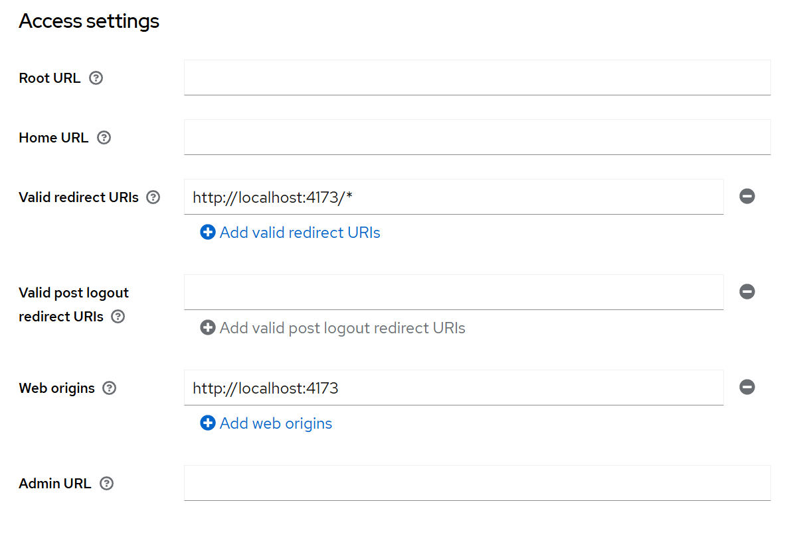
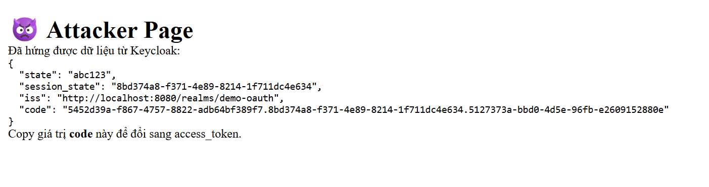
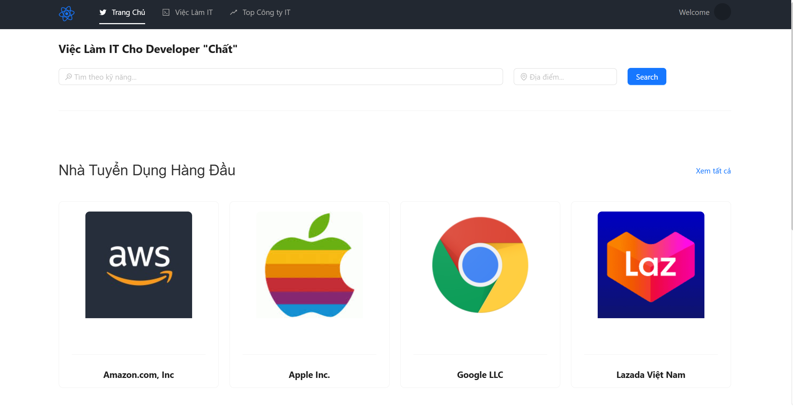

# OAuth2 Misconfiguration Attack – demo misuse redirect_uri để chiếm token và cách fix.

Đây là dự án mô phỏng tấn công **OAuth2 Redirect URI Misconfiguration** sử dụng  
**Keycloak (Authorization Server)**, **React (Client SPA)** và **Spring Boot (Resource Server)**.

Dự án nhằm phục vụ môn **Phát triển Web An toàn**, gồm mô phỏng tấn công và hướng khắc phục.

---

## 👥 1. Danh sách thành viên nhóm

| STT | Họ tên               | MSV       | Nội dung thực hiện          |
|-----|----------------------|---------------|----------------------|
| 1   | Trương Đức Mạnh      | 22810310320    |  Cấu hình Resource Server xác thực token, cấu hình React login bằng OAuth2  |
| 2   | Nguyễn Cát Bộ        | 22810310305    |  Demo tấn công và cách khắc phục           |
| 3   | Nguyễn Thành Đạt     | 22810310314    |  Cấu hình docker và cấu hình Keycloak làm authorization server chính của dự án |

---

## 2. Hướng dẫn chạy dự án (Quick Start)

### 2.1. Yêu cầu môi trường
- Node.js >= 16  
- Java 17  
- Maven  
- Docker Desktop  
- Keycloak 24+  

---

### 2.2. Khởi chạy Keycloak
```bash
docker run -p 8080:8080 --name keycloak \
-e KEYCLOAK_ADMIN=admin \
-e KEYCLOAK_ADMIN_PASSWORD=admin \
quay.io/keycloak/keycloak:24.0.1 start-dev

```

### 2.3. Chạy frontend
```bash
npm install
npm run build
npm run preview
```

### 2.4. Chạy Backend
```bash
mvn spring-boot:run
```

---

##  3. Demo Attack: Redirect URI Misconfiguration

### Bước 1: Attacker tạo URL độc hại
```
http://localhost:8080/realms/demo-oauth/protocol/openid-connect/auth
?client_id=react-client
&response_type=code
&redirect_uri=http://localhost:4173/attacker
```

### Bước 2: Nạn nhân đăng nhập  
### Bước 3: Authorization code bị gửi về trang attacker  
### Bước 4: Attacker đổi code sang access token  
### Bước 5: Attacker dùng token gọi API backend  

\
\
\
\
\
\
\

---

## 5. Biện pháp khắc phục

### ❌ Sai (gây lỗ hổng):
```
http://localhost:4173/*
```

### ✔ Đúng (an toàn):
```
http://localhost:4173/callback
```